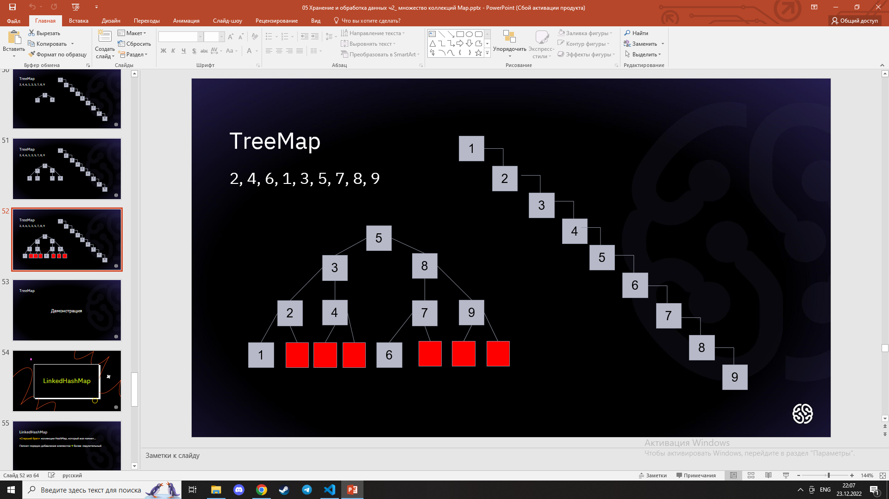
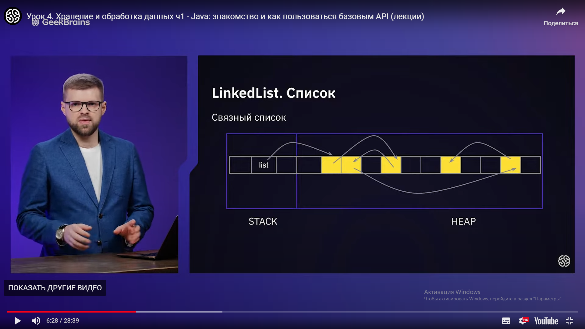
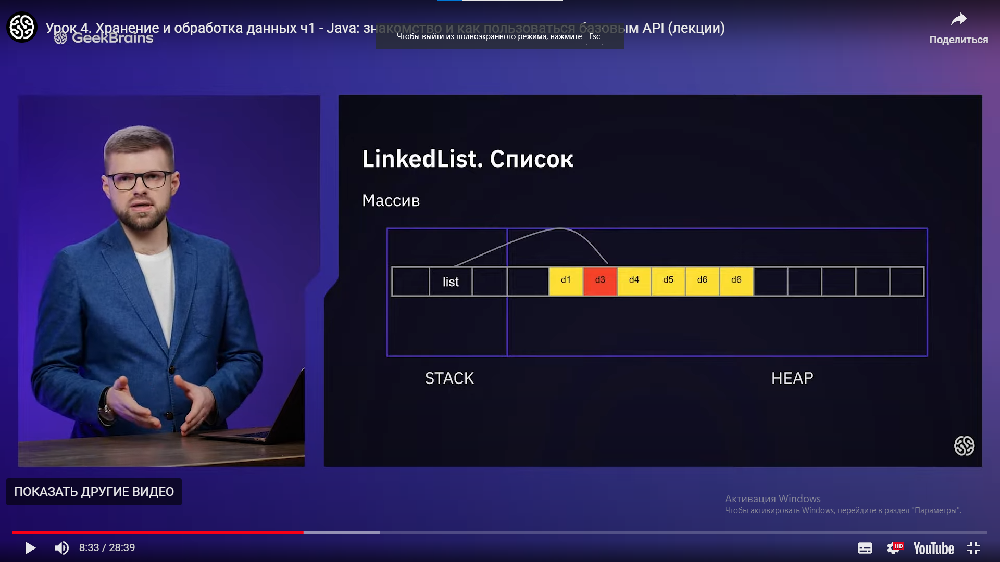

# Типы данных

Делятся по значению на ссылочные(By Reference) и примитивные(By Value).

## Примитивные типы

- byte - 8bit (целочисленный)
- short - 16bit (целочисленный)
- int - 32bit (целочисленный)
- long - 64bit (целочисленный)
- char - 16bit (символьный, только один символ). Обозначается в одинарных кавычках. Например: 'a', 'D', '1', '9', '' и любые одиночные символы. Объекты char всегда заключены в одинарные кавычки.
- float - 32bit (дробный)
- double - 64bit (дробный)
boolean - true или false, 0 или 1, правда/ложь (когда-то его не было в JVM)

У каждого примитива есть свои классы-обертки, которые уже являются не примитивами. У int это Integer, у char это Character и т.д.

Все примитивные типы ограничены в своих значениях. Читаем об этом в ссылках на необходимые дополнительные материалы.

Для целочисленных вычислений эффективнее использовать тип int. Поскольку на уровне JVM для типов byte и short реализованы не все инструкции, как в случае с int. Вот в этом разделе спецификации JVM вы увидете количество определенных операций для целочисленных типов.

Поэтому используйте byte и short только для хранения массивов данных. При любых вычислениях с целыми числами — они автоматически будут приведены к типу int еще на этапе компиляции.

Например, для записи набора целочисленных данных в файле лучше использовать byte или short, в зависимости от необходимости. А, например, для счетчика (i++ он же: i += 1, i = i + 1) лучше использовать тип int. Даже если этот счетчик никогда не превысит значение 3, поскольку Java Virtual Machine просто легче работать с int.

## Ссылочные типы

- class types - Это фактически любой класс в мире java. Например:

- String - тип, который хранит в себе строки. Строки отличаются от char тем, что могут хранить в себе от нуля до более двух миллиардов символов. Объекты String всегда заключены в двойные кавычки: "моя строка"; даже если это один символ: "ф", "9", "j","" и т.д.
Long - тип-обертка над примитивом long. Позволяет производить дополнительные операции над численным типом. Например конвертируя его в String или наоборот.
Object - это суперкласс для всех классов, базовый класс в мире java. От него наследуются все остальные классы. И даже те, которые будете создавать Вы.
Отдельным подвидом class types являются классы-перечисления: enum (enumerators). О них будет отдельный урок.

- array types - массив является специальным типом. Он предназначен для содержания в себе любых других типов, в том числе и массивов (многомерные массивы). За это он и определен в отдельный вид. С массивами мы познакомимся ближе, в четвертом модуле.

- interface - это третий специальный вид типов - пока просто запоминаем. Детально рассмотрим их далее по курсу, чтобы не перегружать этот, и так сложный, урок.

Откуда берутся эти все не примитивные типы: любой класс в java, включая написанный вами, является ссылочным типом (не примитивом), который можно применять в других классах.

Все ссылочные типы обязательно пишутся с большой буквы.
## Коллекции

- ArrayList(Удобный массив)
ArrayList nameList = new ArrayList();
- List - пронумерованный набор элементов.

- LinkedList - пронумерованный набор элементов который расположен в разброс может быть односвязным(каждый элемент имеет информацию о следующем) или двухсвязным (каждый элемент имеет информацию о следующем и предыдущим). Так же есть циклические или не циклические списки.

- Queue - это LinkedList в котором при выведении remove удаляется первый, потом второй и так далее по очереди.

- PriorityQueue - это Queue в котором приоритет имеет не первый в списке обьект, а наименьший.

- Deque - это Queue в котором данные можно вынимать и ложить в начало и конец.

- Stack - это Queue в котором последний положеный вытаскивается первым.(Устаревшая как и Vector)

### Map(+производительность)
[Пример Map](Map.pptx).

Map - Это множество колекций, работающих по принципу <Ключ/Значение>.
1. Допускаются только уникальные ключи, значения могут повторяться.
2. Помните про null значения.
3. Ускоренная обработка данных.
4. Порядок добавления не важен, так как не запоминается.
[Пример Map](Example004.java).
-  HashMap
<
    import java.util.*;

   public static void main(String[] args) {
       Map<Integer,String> map1 = new HashMap<>();//Инициализация на стандартное значение
       Map<Integer,String> map2 = new HashMap<>(9);//Инициализация на не стандартное значение
       Map<Integer,String> map3 = new HashMap<>(9, 1.0f);//Инициализация на не стандартное значение, с указанием когда макс колличество элементов должно увеличиватся
   }
>

HashMap. Любознательным 
- Хэш-функции и хэш-таблицы
- Прямое связывание (хэширование с цепочками)
- Хэширование с открытой адресацией
- Теория графов:
1. деревья построенные на списках
2. бинарные деревья
3. сбалансированные деревья
4. *алгоритм балансировки дерева
5. ** красно-черные деревья, деревья поиска
- TreeMap
[Пример Map](Example005.java).
.
- LinkedHashMap - HashMap который запоминает порядок добавления(медленный).

### Распределение памяти в колекции
- Односвязный список хранится в памяти(в куче(Heap)) в разнобой

.

- Массив хранится по порядку но для добавления или удаления элементов нужно создавать новый массив в куче и удалять старый.

.
## Особенности
- String - единственный тип данных который подходит для использования функций сравнения таких как If, else if, while. Делается это через метеод equals(), который сравнивает значения.
Так же в отличии от других языков программирования строка не является массивом символов в java априори.

Сравнение == это сравнение не значений, а ссылок.

[Пример](Example001.java).

-
-
-

## Нэйминг

Для пременных и метдов camelCase

Для классов PascalCase

# Функции

## Функция сравнения( *If* )

В Java сравнение объектов производится с помощью метода equals() класса Object. Этот метод сравнивает содержимое объектов и выводит значение типа boolean. Значение true - если содержимое эквивалентно, и false — если нет.

Операция == не рекомендуется для сравнения объектов в Java. Дело в том, что при сравнении объектов, операция == вернет true лишь в одном случае — когда ссылки указывают на один и тот же объект. В данном случае не учитывается содержимое переменных класса.

# Try Catch Finaly

## import java.io.IOException;

При работе с фалами в java нужно ловить эту ошибку. Либо способом на весь метод main:

<public static void main(String[] args)**throws IOException** {   }>

Либо на кусок кода в котором будет FileWriter:

static void put_data(){

        try(FileWriter writer = new 
        FileWriter("output.txt")){
            String c_String = String.
            valueOf(c);
            if(c_String.equals("-1")){
                writer.write(a + " ^ " + b + " = " + c_double);
            }else if(c_String.equals("0")){
                writer.write(a + " ^ " + b + " = Не определено");
            }else{
                writer.write(a + " ^ " + b + " = " + c);
            } 
        }catch (IOException e) {
            e.printStackTrace();
        }
    }
   

